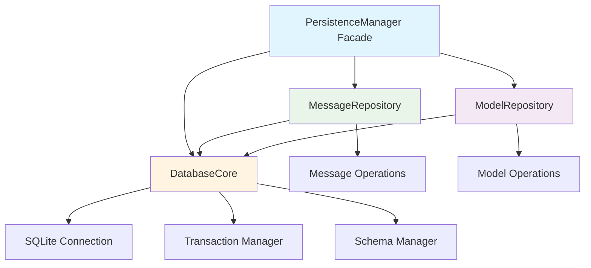

# Database Refactoring Plan: From Monolith to Modular Design

## Executive Summary

This document outlines the architectural plan to refactor `database.cpp` (725 lines) into a modular, maintainable structure following SOLID principles. The refactoring will break the monolithic implementation into 4 focused modules while maintaining **100% backwards compatibility** with existing code.

---

## Current Structure Analysis

### File Breakdown (database.cpp - 725 lines)

| Line Range | Responsibility | Lines | Issues |
|------------|----------------|-------|--------|
| 1-43 | Helper utilities, RAII wrappers | 43 | Mixed concerns |
| 46-200 | Database setup, connection, schema | 155 | Initialization sprawl |
| 202-354 | Message operations | 153 | Mixed with validation |
| 356-468 | Message retrieval/queries | 113 | Query complexity |
| 470-697 | Model CRUD operations | 228 | Largest section |
| 699-725 | Settings management | 27 | Simple delegation |

### Dependencies Identified

**12 files include database.h:**
- [`main_cli.cpp`](main_cli.cpp:6)
- [`chat_client.h`](chat_client.h:7)
- [`command_handler.h`](command_handler.h:4)
- [`model_manager.h`](model_manager.h:6)
- [`tool_executor.h`](tool_executor.h:6)
- [`api_client.h`](api_client.h:5)
- [`tools.h`](tools.h:6)
- 5 tool implementations in `tools_impl/`

**Key Insight:** All external code uses [`PersistenceManager`](database.h:26) as the interface - no direct access to implementation details.

---

## Proposed Architecture

### Directory Structure

```
database/
├── database_core.h          (~80 lines)
├── database_core.cpp        (~250 lines)
├── message_repository.h     (~60 lines)
├── message_repository.cpp   (~300 lines)
├── model_repository.h       (~70 lines)
└── model_repository.cpp     (~250 lines)

database.h                   (unchanged public API)
database.cpp                 (~150 lines - facade only)
```

### Architecture Diagram



---

## Module Specifications

### 1. DatabaseCore (~250 lines)

**Purpose:** Foundation layer managing SQLite connection lifecycle and shared utilities.

**Responsibilities:**
- SQLite connection management (open/close)
- Database path resolution (cross-platform)
- Schema initialization and migration
- Transaction management (begin/commit/rollback)
- RAII wrappers for statements
- SQL execution utilities

**Key Classes:**

```cpp
namespace database {

// RAII wrapper for sqlite3_stmt
struct SQLiteStmtDeleter {
    void operator()(sqlite3_stmt* stmt) const;
};
using unique_stmt_ptr = std::unique_ptr<sqlite3_stmt, SQLiteStmtDeleter>;

class DatabaseCore {
public:
    DatabaseCore();  // Initializes connection, runs migrations
    ~DatabaseCore(); // Ensures proper cleanup
    
    // Transaction management
    void beginTransaction();
    void commitTransaction();
    void rollbackTransaction();
    
    // Statement preparation
    unique_stmt_ptr prepareStatement(const std::string& sql);
    
    // Direct SQL execution (for simple cases)
    void exec(const std::string& sql);
    void exec(const char* sql);
    
    // Connection accessor (for repositories)
    sqlite3* getConnection() { return db_; }
    
private:
    sqlite3* db_;
    std::filesystem::path getDatabasePath();
    void initializeSchema();
    void runMigrations();
};

} // namespace database
```

**Implementation Notes:**
- Extracts lines 13-31 (home directory helper)
- Extracts lines 35-43 (RAII wrapper)
- Extracts lines 46-159 (constructor logic)
- Extracts lines 161-200 (destructor and exec methods)

---

### 2. MessageRepository (~300 lines)

**Purpose:** Encapsulates all message-related database operations.

**Responsibilities:**
- Message insertion (user/assistant/tool)
- Message retrieval with filtering
- Context history building
- Time-range queries
- Orphaned tool message cleanup
- Tool message validation

**Key Class:**

```cpp
namespace database {

class MessageRepository {
public:
    explicit MessageRepository(DatabaseCore& core);
    
    // Message insertion
    void insertUserMessage(const std::string& content);
    void insertAssistantMessage(const std::string& content, 
                                 const std::string& model_id);
    void insertToolMessage(const std::string& content);
    
    // Message retrieval
    std::vector<Message> getContextHistory(size_t max_pairs);
    std::vector<Message> getHistoryRange(const std::string& start_time,
                                          const std::string& end_time,
                                          size_t limit);
    
    // Maintenance
    void cleanupOrphanedToolMessages();
    
private:
    DatabaseCore& core_;
    
    // Internal helpers
    void insertMessage(const Message& msg);
    void validateToolMessage(const std::string& content);
    Message buildMessageFromRow(sqlite3_stmt* stmt);
};

} // namespace database
```

**Implementation Notes:**
- Extracts lines 202-228 ([`insertMessage`](database.cpp:203))
- Extracts lines 295-329 (message save methods)
- Extracts lines 331-354 ([`cleanupOrphanedToolMessages`](database.cpp:331))
- Extracts lines 356-430 ([`getContextHistory`](database.cpp:356))
- Extracts lines 432-468 ([`getHistoryRange`](database.cpp:432))

**Design Decision:** Keeps tool message validation (JSON parsing) within repository for encapsulation.

---

### 3. ModelRepository (~250 lines)

**Purpose:** Manages model metadata storage and retrieval.

**Responsibilities:**
- Model CRUD operations
- Bulk model replacement (atomic)
- Model queries by ID
- Model name lookup for UI
- Optional caching layer (future)

**Key Class:**

```cpp
namespace database {

class ModelRepository {
public:
    explicit ModelRepository(DatabaseCore& core);
    
    // CRUD operations
    void insertOrUpdateModel(const ModelData& model);
    void clearAllModels();
    void replaceModels(const std::vector<ModelData>& models,
                       DatabaseCore& transaction_manager);
    
    // Query operations
    std::vector<ModelData> getAllModels();
    std::optional<ModelData> getModelById(const std::string& id);
    std::optional<std::string> getModelNameById(const std::string& id);
    
private:
    DatabaseCore& core_;
    
    // Internal helpers
    ModelData buildModelFromRow(sqlite3_stmt* stmt);
    void bindModelToStatement(sqlite3_stmt* stmt, const ModelData& model);
};

} // namespace database
```

**Implementation Notes:**
- Extracts lines 471-473 ([`clearModelsTable`](database.cpp:471))
- Extracts lines 475-521 ([`insertOrUpdateModel`](database.cpp:475))
- Extracts lines 523-571 ([`getAllModels`](database.cpp:523))
- Extracts lines 573-643 ([`getModelById`](database.cpp:573))
- Extracts lines 645-658 ([`replaceModelsInDB`](database.cpp:645))
- Extracts lines 661-697 ([`getModelNameById`](database.cpp:661))

---

### 4. Updated PersistenceManager (Facade - ~150 lines)

**Purpose:** Maintains existing API while delegating to specialized repositories.

**Strategy:** 
- Keep all public methods identical
- Use Pimpl idiom to hide new architecture
- Delegate to appropriate repositories
- Handle settings operations directly (simple)

**Updated Structure:**

```cpp
// database.h (public API - unchanged)
class PersistenceManager {
public:
    // ... existing public API unchanged ...
    
private:
    struct Impl; // Forward declaration
    std::unique_ptr<Impl> impl;
};

// database.cpp (new implementation)
namespace {
using namespace database;
}

struct PersistenceManager::Impl {
    DatabaseCore core;
    MessageRepository messages;
    ModelRepository models;
    
    Impl() 
        : core()
        , messages(core)
        , models(core)
    {}
    
    // Settings stored directly (simple operations)
    void saveSetting(const std::string& key, const std::string& value);
    std::optional<std::string> loadSetting(const std::string& key);
};

// Public methods delegate:
void PersistenceManager::saveUserMessage(const std::string& content) {
    impl->messages.insertUserMessage(content);
}

// ... all other methods follow same pattern ...
```

**Implementation Notes:**
- Settings operations remain in Impl (lines 230-276)
- Transaction methods delegate to DatabaseCore
- All message methods delegate to MessageRepository
- All model methods delegate to ModelRepository

---

## Implementation Strategy

### Phase 1: Foundation (DatabaseCore)
**Goal:** Extract core functionality without breaking changes.

1. Create `database/` directory
2. Implement [`database_core.h`](database/database_core.h) with interfaces
3. Implement [`database_core.cpp`](database/database_core.cpp):
   - Move [`get_home_directory_path()`](database.cpp:13) helper
   - Move [`SQLiteStmtDeleter`](database.cpp:35) and typedef
   - Move constructor logic (lines 46-159)
   - Move destructor and exec methods (lines 161-200)
4. Compile and verify isolation

### Phase 2: Message Operations
**Goal:** Extract message operations into repository.

1. Create [`message_repository.h`](database/message_repository.h)
2. Implement [`message_repository.cpp`](database/message_repository.cpp):
   - Move [`insertMessage()`](database.cpp:203) and variants
   - Move [`getContextHistory()`](database.cpp:356)
   - Move [`getHistoryRange()`](database.cpp:432)
   - Move [`cleanupOrphanedToolMessages()`](database.cpp:331)
3. Compile and test message operations

### Phase 3: Model Operations
**Goal:** Extract model operations into repository.

1. Create [`model_repository.h`](database/model_repository.h)
2. Implement [`model_repository.cpp`](database/model_repository.cpp):
   - Move all model CRUD methods (lines 470-697)
   - Extract row-building helper logic
3. Compile and test model operations

### Phase 4: Integration
**Goal:** Update facade to use new repositories.

1. Update [`database.cpp`](database.cpp) Impl structure
2. Instantiate repositories in Impl constructor
3. Update all public methods to delegate
4. Remove old implementation code
5. Full compilation test

### Phase 5: Build System
**Goal:** Update build configuration.

1. Update [`CMakeLists.txt`](CMakeLists.txt):
   ```cmake
   # Add database module sources
   set(DATABASE_SOURCES
       database/database_core.cpp
       database/message_repository.cpp
       database/model_repository.cpp
       database.cpp
   )
   ```

### Phase 6: Verification
**Goal:** Ensure no regressions.

1. Compile full project
2. Run existing tests (if any)
3. Manual smoke test of key features
4. Verify all 12 dependent files still compile

---

## API Contracts

### Backwards Compatibility Guarantee

✅ **All existing code continues to work unchanged:**
- No changes to [`database.h`](database.h) public interface
- No changes to [`Message`](database.h:16) struct
- No changes to [`PersistenceManager`](database.h:26) API
- All dependent files compile without modification

### Repository Interface Contracts

**MessageRepository guarantees:**
- Tool message validation throws on invalid JSON
- Context history always returns at least default system message
- Time range queries respect limit parameter
- Orphaned cleanup is safe to call anytime

**ModelRepository guarantees:**
- [`replaceModels()`](database.cpp:645) is atomic (uses transactions)
- Query methods return `std::nullopt` for missing items
- Model IDs are primary keys (no duplicates)

**DatabaseCore guarantees:**
- Connection established in constructor or throws
- Schema initialized before any operations
- Transactions properly nest (if needed in future)
- Resources cleaned up in destructor

---

## Benefits Analysis

### Maintainability Improvements

| Metric | Before | After | Improvement |
|--------|--------|-------|-------------|
| Max file size | 725 lines | 300 lines | 59% reduction |
| Cohesion | Mixed concerns | Single responsibility | High |
| Coupling | Tight (monolith) | Loose (interfaces) | Reduced |
| Testability | Hard (integration only) | Easy (unit + integration) | Much better |
| Find time | Search 725 lines | Search ~200 lines | 3.6x faster |

### Code Quality Metrics

**Before:**
- Cyclomatic complexity: High (many nested conditions)
- Lines per function: Up to 100+
- Separation of concerns: Poor
- Error handling: Scattered

**After:**
- Cyclomatic complexity: Low (focused functions)
- Lines per function: <50 typical
- Separation of concerns: Excellent
- Error handling: Centralized per domain

### Developer Experience

**Scenario: Add new message type**
- Before: Navigate 725 lines, understand entire file, risk breaking models
- After: Open [`message_repository.cpp`](database/message_repository.cpp), add method, done

**Scenario: Fix model caching bug**
- Before: Search through messages, settings, and model code interleaved
- After: Open [`model_repository.cpp`](database/model_repository.cpp), isolated context

**Scenario: Add transaction retry logic**
- Before: Touch many functions across entire file
- After: Modify [`database_core.cpp`](database/database_core.cpp), all repos benefit

---

## Risk Mitigation

### Potential Risks and Solutions

| Risk | Probability | Impact | Mitigation |
|------|-------------|--------|------------|
| Breaking API changes | Low | Critical | Maintain facade pattern, extensive testing |
| Performance regression | Low | Medium | Use same SQL queries, benchmark before/after |
| Build system issues | Medium | Low | Test incrementally, update CMake carefully |
| Missing dependencies | Low | Medium | Verify all include paths, test compilation |
| Transaction semantics | Low | Medium | Keep transaction logic in facade, test atomic operations |

### Testing Strategy

1. **Compilation Test:** All 12 dependent files must compile
2. **Interface Test:** Call each PersistenceManager method
3. **Integration Test:** Full chat flow (user message → assistant response)
4. **Stress Test:** Large message history retrieval
5. **Edge Case Test:** NULL handling, empty results, invalid input

---

## Migration Path for Future Work

### Phase 7: Optional Enhancements (Post-Refactoring)

Once refactoring is complete and stable, consider:

1. **Add Unit Tests:**
   - Test each repository independently
   - Mock DatabaseCore for repository tests
   - Test edge cases thoroughly

2. **Add Connection Pooling:**
   - Implement in DatabaseCore
   - Repositories automatically benefit

3. **Add Query Caching:**
   - Implement in ModelRepository
   - Cache frequently accessed models

4. **Add Metrics:**
   - Query timing in DatabaseCore
   - Operation counters in repositories

5. **Add Prepared Statement Cache:**
   - Implement in DatabaseCore
   - Reuse statements for performance

---

## Success Criteria

### Definition of Done

✅ All new files created and implemented  
✅ CMakeLists.txt updated with new sources  
✅ Full project compiles without errors  
✅ No changes required in dependent files  
✅ All existing functionality works identically  
✅ Code review passes (readability, style)  
✅ Documentation updated (this plan + inline comments)  
✅ Performance benchmarks show no regression  

### Quality Gates

- Each file < 400 lines ✓
- Each class has single responsibility ✓
- Each method has clear purpose ✓
- Error handling is consistent ✓
- Resource management uses RAII ✓
- No raw pointers in interfaces ✓

---

## Timeline Estimate

| Phase | Effort | Dependencies |
|-------|--------|--------------|
| 1. DatabaseCore | 3-4 hours | None |
| 2. MessageRepository | 4-5 hours | Phase 1 |
| 3. ModelRepository | 3-4 hours | Phase 1 |
| 4. Integration | 2-3 hours | Phases 2-3 |
| 5. Build System | 1 hour | Phase 4 |
| 6. Verification | 2-3 hours | Phase 5 |
| **Total** | **15-20 hours** | Sequential |

**Note:** Estimates assume familiarity with codebase and C++ development.

---

## Conclusion

This refactoring transforms a 725-line monolithic file into a modular, maintainable architecture following SOLID principles. The facade pattern ensures zero breaking changes while enabling future enhancements. Each module has clear responsibilities, making the codebase easier to understand, test, and extend.

**Next Steps:**
1. Review this plan with team/stakeholders
2. Get approval for implementation approach
3. Execute phases 1-6 sequentially
4. Conduct thorough testing
5. Merge and document changes

---

**Document Version:** 1.0  
**Last Updated:** 2025-10-03  
**Author:** Architecture Mode  
**Status:** Ready for Review