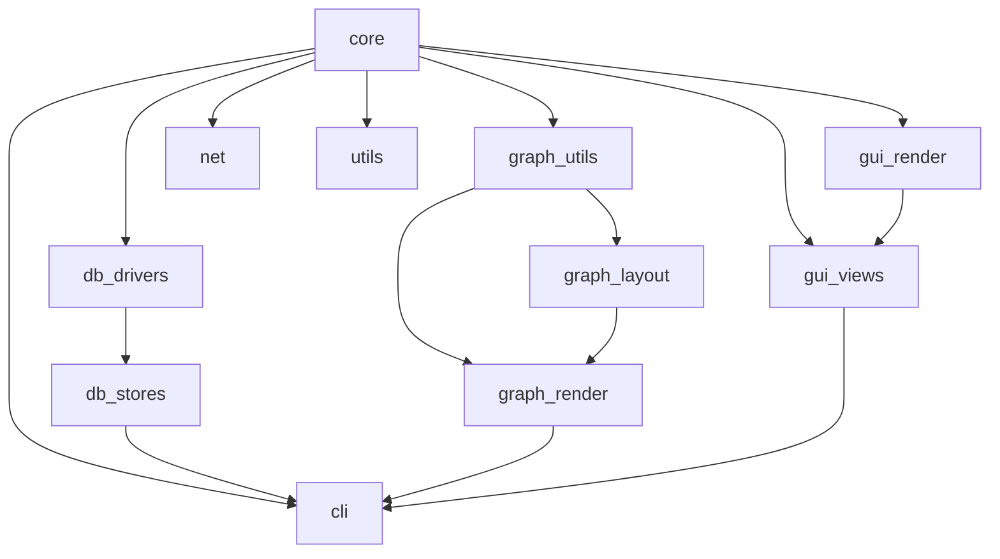

# Migration Roadmap

This document captures the approved phased rollout for converting the repository to the new logical source-tree described in [docs/source_tree_plan.md](source_tree_plan.md).

## Phase Overview

| Phase | Summary | Commit Tag |
| --- | --- | --- |
| 0 | Skeleton & root CMake stubs | `skeleton` |
| 1 | Core domain migrated | `migrate-core` |
| 2 | GUI domain migrated | `migrate-gui` |
| 3 | Graph domain migrated | `migrate-graph` |
| 4 | DB domain migrated | `migrate-db` |
| 5 | CLI domain migrated | `migrate-cli` |
| 6 | Utils & Net migrated | `migrate-utils-net` |
| 7 | Tests refreshed | `refresh-tests` |
| 8 | Cleanup & Install verification | `cleanup-install` |

## Detailed Steps

### Phase 0 — Bootstrap
1. Generate directory skeleton exactly as in the plan: `include/`, `src/`, `tests/`, `resources/`, `docs/`, `scripts/`, `extern/`, with all nested leaf folders.  
2. Add minimal `CMakeLists.txt` stub to every leaf that will host sources:  

   ```cmake
   add_library(<name> OBJECT)
   target_include_directories(<name>
       PUBLIC  ${PROJECT_SOURCE_DIR}/include
       PRIVATE ${CMAKE_CURRENT_SOURCE_DIR})
   # target_link_libraries(<name> PRIVATE …) — filled later
   ```
3. Update root `CMakeLists.txt` with `add_subdirectory()` calls per leaf plus `add_subdirectory(tests)`.  
4. Commit as **“skeleton + CMake stubs”**.

### Phase 1 — Core
* Move `main_gui_core.cpp`, `event_dispatch.*`, and other core level files.  
* Update includes to `include/core/…`.  
* Flesh out `src/core/CMakeLists.txt`, add install clauses.  
* Build & run core unit tests.  
* Commit **“core migrated”**.

### Phase 2 — GUI
* Sub-folders: `render/`, `views/`.  
* Move `main_gui_views.*`, `gui_interface.*`, `font_utils.*`, `theme_utils.*`.  
* Update includes.  
* Provide `render` and `views` CMake targets, link to `core`.  
* Build & test.  
* Commit **“gui migrated”**.

### Phase 3 — Graph
* Sub-folders: `layout/`, `render/`, `utils/`.  
* Apply mapping rules for layouts, renderers, `graph_*`, etc.  
* Ensure link order: `graph/layout` & `graph/utils` → `core`; `graph/render` → `core`, `graph/utils`.  
* Commit **“graph migrated”**.

### Phase 4 — DB
* Folders `drivers/`, `stores/`.  
* Migrate `*_connection.*`, `*_store.*`, etc.  
* Libraries link to `core`.  
* Commit **“db migrated”**.

### Phase 5 — CLI
* Move `cli_interface.*`, `main_cli.cpp`.  
* Link to `core;db;graph;gui`.  
* Commit **“cli migrated”**.

### Phase 6 — Utils & Net
* Migrate remaining `*_utils.*` plus `chat_client_*.*`.  
* Create `utils` and `net` libraries; link hierarchically.  
* Commit **“utils & net migrated”**.

### Phase 7 — Tests Refresh
* Mirror `include/` hierarchy under `tests/`.  
* Update includes and CMake.  
* Commit **“tests refreshed”**.

### Phase 8 — Cleanup & Install
1. Remove any transitional shim headers once CI passes.  
2. Verify `cmake --install` copies `include/` properly.  
3. Update `README.md` and regenerate Doxygen.  
* Commit **“cleanup & install verified”**.

## Dependency Ladder



## Guardrails
• Keep every source file ≤ 500 LOC; split as needed.  
• Public headers include only other public headers.  
• After each phase run unit tests and `include-what-you-use`.  
• CI must stay green before starting the next phase.